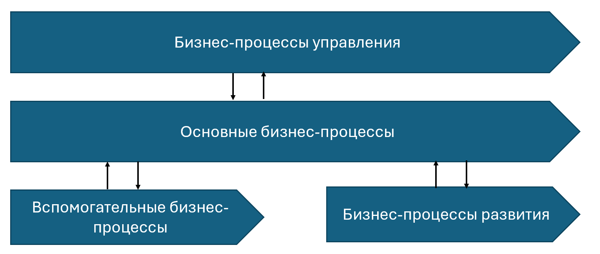
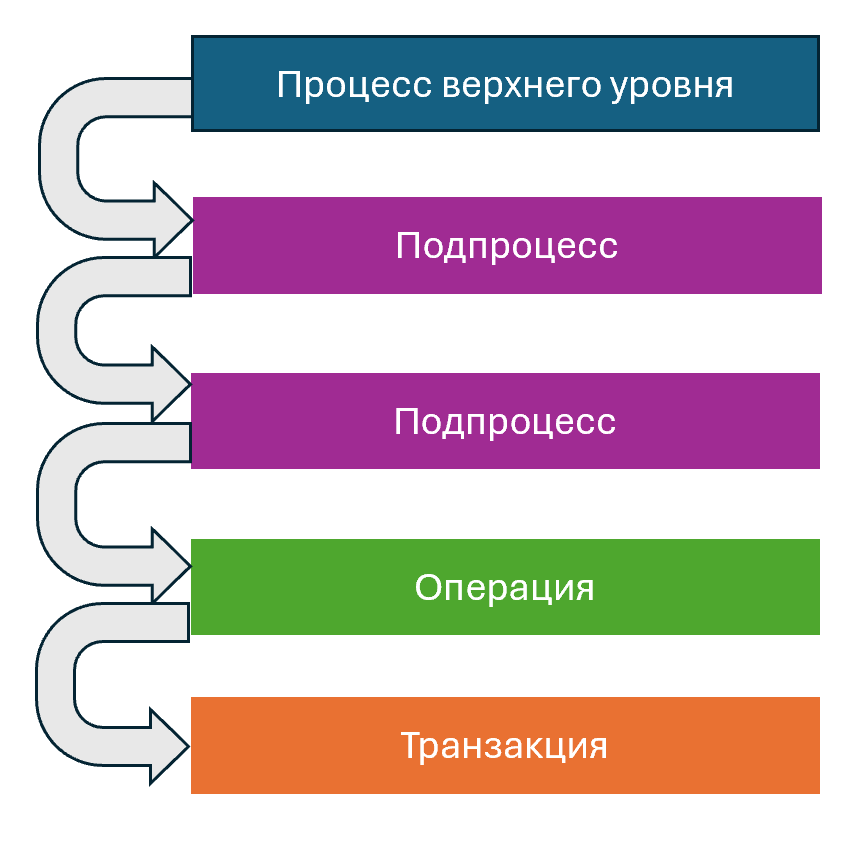

# Лекция №1

## Понятие бизнес-процесса
**Бизнес-процесс** – это цепь связанных, повторяющихся действий, в результате которых используются ресурсы предприятия для переработки объекта (физического или виртуального) с целью достижения определенных измеримых результатов или создания продукции для удовлетворения внутренних или внешних потребителей

**Свойства бизнес-процесса**:
- Логически связанная цепочка действий
- Повторяемость
- Создание ценности для потребителя
- Пересечение организационных или функциональных границ
- Преобразование входа и выхода с использованием ресурсов
- Наличие цели
- Измеримость результатов

## Бизнес-процесс и проект
Параметр сравнения                 | Бизнес-процесс                                       | Проект
-----------------------------------|------------------------------------------------------|--------------------------------------------------------
Цикличность                        | Регулярно повторяется                                | Выполняется один раз
Уникальность результата            | Предсказуемый результат при каждом запуске           | Результат уникален
Ресурсы                            | Ресурсы постоянны                                    | Ресурсы ограниченны
Время                              | Временные характеристики постоянны                   | Время ограничено
Рискоёмкость                       | Низкая                                               | Высокая
Методическая основа для управления | Процессный подход к управлению, TQM, ISO 9000 и т.д. | Проектное управление, PMBOK и т.д.
Инструменты                        | Регламенты, методические рекомендации и т.д.         | Диаграмма Ганта, сетевая диаграмма, матрица ролей и т.д.

**Примеры**: 
- Бизнес-процесс: пошив одежды на швейной фабрике
- Проект: пошив платья под зака в ателье

## Подходы к управлению организацией
1. **Функциональный**:
   - определение границ между подразделениями по принципу функциональных областей
   - разделения труда между службами, отделами, цехами, бригадами с закреплением за ними определенных функций
2. **Процессный**:
   - управления компанией ориентируется как на управление каждым бизнес-процессом в отдельности, так и всеми бизнес-процессами предприятия в целом
   - широкое делегирование полномочий и ответственности исполнителям
3. **Проектный**:
   - применяется для проектно-ориентированных компаний (например, строительных)

## Бизнес-процессы верхнего уровня
**Важно!**
- Для анализа бизнес-процессов важен **системный подход** (иначе хаос)
- В самом начале важно выделить **все** бизнес-процессы **одного уровня**
- Обычно начинают с бизнес-процессов **верхнего уровня** (связанные с миссией и стратегией компании)
- Обычно насчитывают **15-20** бизнес-процессов верхнего уровня

**Миссия** = зачем существует компания? (Пример: *производство продукта А*)
**Стратигические цели** = чего она хочет достичь? (Пример: *15% рынка с продуктом А*)
*Каждой стратегической цели организации соответствует как минимум один бизнес-процесс*

Все бизнес-процессы верхнего уровня обычно объединяют в **четыре группы**:

Все бизнес-процессы **не являются изолированными**, они активно взаимодействуют друг с другом как внутри групп, так и между группами. Это касается не только бизнес-процессов верхнего уровня.

Группа бизнес-процесса          | Результат                                                               | Потребители                                                 | Описание
--------------------------------|-------------------------------------------------------------------------|-------------------------------------------------------------|----------
Основные бизнес-процессы        | Создаваемые компанией продукты/услуги                                   | Внешние (клиенты и партнеры компании)                       | - Составляют основную суть и смысл деятельности организации  - Создают добавленную стоимость, сфокусированы на получение прибыли  - Кросс-функциональны, имеют отраслевую специфику
Вспомогательные бизнес-процессы | Инфраструктура и ресурсы для деятельности компании                      | Внутренние (другие процессы и подразделения компании) | - Поддерживают основные (так же  известны как «поддерживающие», «обеспечивающие»)  - Отраслевая специфика вырождена слабо  - Вспомогательные - не значит второсортные
Бизнес-процессы управления      | Достижение целей деятельности компании                                  | Акционеры, инвесторы, клиенты, сотрудники, поставщики и т.д. | - Обеспечивают управление организацией как единой системой: Целеполагание, Планирование, Контроль достижения целей, Анализ и выработка корректирующих воздействий  - Координация действий отдельных элементов
Бизнес-процессы развития        | Создание конкурентных преимуществ, расширение позиций компании на рынке | Другие процессы компании | - Определяют тенденции и направление основных процессов  - Включают инвестиционные и инновационные проекты  - Нацелены на получение прибыли в долгосрочной перспективе

**Признаки** бизнес-процессов верхнего уровня:
- Одинаковая или схожая значимость – соответствие стратегическим целям
- Отражение логики деятельности – цепочка добавленной стоимости
- Полнота и простота модели
- Отсутствие дублирования и пересечения

## Декомпозиция бизнес-процессов
**Декомпозиция** — разделение большого и сложного на небольшие простые части. Количество уровней декомпозиции процессов зависит от целей и задач моделирования.

**Пример декомпозиции**:

Приготовить утренний кофе
- Приготовить чашу для кофе
  - Открыть дверцу шкафа
  - Взять чистую чашку
  - Поставить чашку на платформу кофеварки
- Включить кофеварку
- Смолоть зерна для кофе
  - Открыть дверцу шкафа
  - Достать пакет с кофе
  - Насыпать зерна кофе в кофемолку
  - Молоть кофе в кофемолке
  - Высыпать молотый кофе в рожок кофемашины
- Сварить кофе в кофеварке
  - Выбрать программу
  - Нажать кнопку старт
  - Ожидать окончания процесса варки кофе
