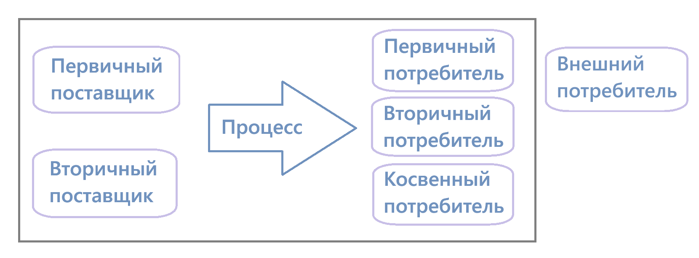

# Лекция 2

## Название бизнес-процесса
- Должно быть коротким, но полным и точным
- Из названия должно быть понятно что и с чем делает бизнес-процесс

*Название = Действие + Объект + Уточнение*

**Примеры названий**:
1) Разработка прогноза продаж
2) Ведение учета основных средств
3) Подготовка товарных документов
4) Управление возмещением убытков

## Входы бизнес-процессов
**Первичный вход** - изначальные материальные и нематериальные входы, запускающие операции процесса (информационные, материальные людские потоки, поступающие в процесс из внешней среды)
**Вторичный вход** - потоки, являющиеся вспомогательными

## Выходы бизнес-процессов
**Первичные выходы** - основной результат выполнения бизнес-процесса (принятие решения, готовое изделие)
**Вторичный выходы** - передаваемые в другие процессы вторичные продукты. Их производство не является основной частью процесса (информация о сбоях в работе, информация о дате и времени выпуска продукта)

Выходы (как первичные, так и вторичные) могут быть как метриальными, так и нематериальными.

## Ресурсное окружение бизнес-процессов
Ресурсное окружение - все потребляемые процессом ресурсы для производства выходного результата (продукта, услуги). В ресурсное окружение могут входить:
- сотрудники
- знания и полномочия
- документы
- продукция поставщиков
- данные и информация
- технические и материальные услуги

## Поставщики и потребители

Не всегда присутствуют **все виды** поставщиков и потребителей сразу!

